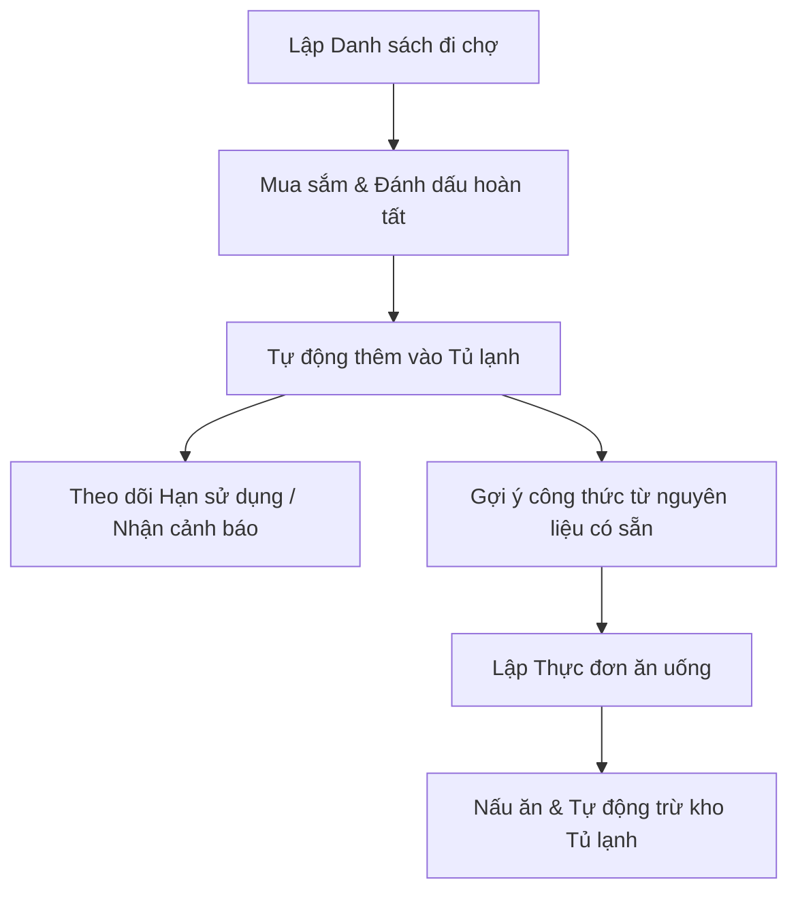

# 🍳 HomeFridge - Hệ Thống Đi Chợ & Quản Lý Thực Phẩm Tiện Lợi (MVP)

> **Mục tiêu dự án:** Hỗ trợ lập kế hoạch mua sắm thông minh, quản lý thực phẩm trong tủ lạnh hiệu quả, và tự động đề xuất thực đơn hàng ngày nhằm giảm thiểu lãng phí và đảm bảo dinh dưỡng cho cả gia đình.

---

## 👥 1. Tác Nhân (Actors) & Ca Sử Dụng (Use Cases)

### 1.1 Tác nhân trong hệ thống

Hệ thống được thiết kế xoay quanh các tác nhân chính sau:

| Tác nhân                            | Vai trò & Mô tả                                                                                                                     |
| :---------------------------------- | :---------------------------------------------------------------------------------------------------------------------------------- |
| **👩‍🍳 Người nội trợ (Homemaker)**    | Quản lý kho thực phẩm, lên thực đơn, tạo và quản lý danh sách đi chợ, duyệt/từ chối các yêu cầu đề xuất món ăn từ thành viên.       |
| **👨‍👩‍👧‍👦 Thành viên gia đình (Member)** | Tham gia vào nhóm gia đình, gửi yêu cầu đề xuất món ăn cho thực đơn ngày, cùng chia sẻ và cập nhật danh sách đi chợ.                |
| **🔧 Quản trị viên (Admin)**        | Quản trị tài khoản người dùng, cấu hình dữ liệu nền (danh mục thực phẩm, đơn vị tính, công thức nấu ăn chuẩn) và giám sát hệ thống. |
| **🤖 Thiết bị thông minh (Device)** | _(Tùy chọn mở rộng)_ Đồng bộ dữ liệu tủ lạnh tự động (quét mã, cảm biến...).                                                        |

### 1.2 Bản đồ Use Cases chính

- **Đối với Người nội trợ & Thành viên:**
  - Đăng ký / Đăng nhập / Quản lý thông tin cá nhân.
  - Tạo nhóm gia đình & Mời thành viên gia đình tham gia.
  - Quản lý Tủ lạnh (Thêm, sửa, xóa, tìm kiếm thực phẩm, theo dõi hạn sử dụng).
  - Quản lý Danh sách đi chợ (Lập danh sách, phân loại thực phẩm, đánh dấu đã mua, chia sẻ đồng bộ thời gian thực).
  - Quản lý Thực đơn (Lập thực đơn ngày/tuần, nhận gợi ý món ăn từ thực phẩm sẵn có, yêu cầu món ăn).
- **Đối với Admin:**
  - Quản lý người dùng & phân quyền hệ thống.
  - Quản lý Danh mục (Categories, Units).
  - Quản lý Thư viện công thức nấu ăn mẫu.

---

## 📦 2. Các Phân Hệ Chức Năng Cốt Lõi (Core Modules)

### 🛒 2.1 Phân hệ Danh sách đi chợ (Shopping List)

- **Lập danh sách linh hoạt:** Hỗ trợ tạo danh sách mua sắm theo ngày, tuần hoặc theo sự kiện.
- **Tự động phân loại:** Nhóm các nguyên liệu cần mua theo loại (rau củ, thịt cá, gia vị, đồ khô) để thuận tiện khi đi siêu thị.
- **Chia sẻ & Đồng bộ:** Các thành viên trong nhóm gia đình có thể xem chung và cập nhật trạng thái mua sắm theo thời gian thực (real-time).
- **Tích hợp tủ lạnh:** Tự động đẩy các thực phẩm đã mua hoàn tất vào kho tủ lạnh.

### ❄️ 2.2 Phân hệ Quản lý Tủ lạnh (Fridge Management)

- **Quản lý tồn kho:** Lưu trữ chi tiết tên thực phẩm, số lượng, đơn vị, vị trí lưu trữ (Ngăn đông, Ngăn mát, Hộc rau củ, Cánh tủ, Kệ đồ khô).
- **Cảnh báo thông minh:** Hệ thống tự động cảnh báo khi thực phẩm sắp hết hạn (trước 3 ngày) hoặc đã quá hạn để người dùng có kế hoạch tiêu thụ kịp thời.
- **Tìm kiếm & Lọc:** Tìm kiếm nhanh thực phẩm theo tên, vị trí hoặc lọc theo trạng thái (tươi ngon, sắp hết hạn, đã hết hạn).

### 🍽️ 2.3 Phân hệ Thực đơn & Gợi ý món ăn (Menu & Recipe Recommendation)

- **Lập kế hoạch bữa ăn:** Thiết lập thực đơn bữa trưa/tối theo ngày hoặc tuần.
- **Gợi ý thông minh (Smart Suggestions):** Thuật toán tự động phân tích nguyên liệu sắp hết hạn hoặc đang có sẵn trong tủ lạnh để đề xuất các công thức nấu ăn phù hợp nhất.
- **Yêu cầu món ăn:** Thành viên gia đình gửi yêu cầu món ăn mong muốn vào thực đơn; Người nội trợ phê duyệt hoặc từ chối yêu cầu đó.
- **Mua sắm thông minh:** Tự động tính toán lượng nguyên liệu thiếu khi chọn một thực đơn và thêm chúng vào Danh sách đi chợ.

### 📊 2.4 Phân hệ Báo cáo & Thống kê (Reports & Analytics)

- **Thống kê mua sắm:** Tổng hợp chi phí, khối lượng thực phẩm đã mua theo tuần, tháng.
- **Báo cáo lãng phí:** Thống kê lượng thực phẩm bị bỏ đi do hết hạn sử dụng nhằm giúp người dùng điều chỉnh hành vi mua sắm.

---

## 🔄 3. Quy Trình Nghiệp Vụ Đặc Thù (Workflows)

### 3.1 Quy trình: Từ Siêu thị vào Tủ lạnh

1.  Người nội trợ lập danh sách đi chợ trên hệ thống, phân chia cho thành viên.
2.  Thành viên đi mua sắm, tích chọn hoàn thành trực tiếp trên app.
3.  Khi chuyến mua sắm hoàn tất, hệ thống tự động cộng dồn số lượng thực phẩm đó vào danh sách thực phẩm trong Tủ lạnh tương ứng với vị trí lưu trữ mặc định hoặc do người dùng chọn.

### 3.2 Quy trình: Từ Tủ lạnh ra Bàn ăn

1.  Người dùng xem danh sách gợi ý món ăn dựa trên nguyên liệu đang có sẵn trong tủ lạnh (ưu tiên nguyên liệu sắp hết hạn).
2.  Người dùng chọn món ăn và thêm vào thực đơn ngày.
3.  Khi người dùng bấm **"Bắt đầu nấu"** hoặc **"Đã hoàn thành nấu"**, hệ thống sẽ tự động trừ đi số lượng nguyên liệu tương ứng trong tủ lạnh theo định lượng của công thức nấu ăn.

### 3.3 Quy trình: Theo dõi & Cảnh báo hạn dùng

1.  Mỗi khi thực phẩm được thêm vào tủ lạnh (thủ công hoặc qua danh sách đi chợ), người dùng nhập hoặc hệ thống tự động đề xuất Hạn sử dụng (Expiry Date).
2.  Hằng ngày, hệ thống chạy tiến trình kiểm tra và gửi thông báo nhắc nhở (Notification) cho các thành viên gia đình về những thực phẩm sắp hết hạn trong vòng 3 ngày tới.
